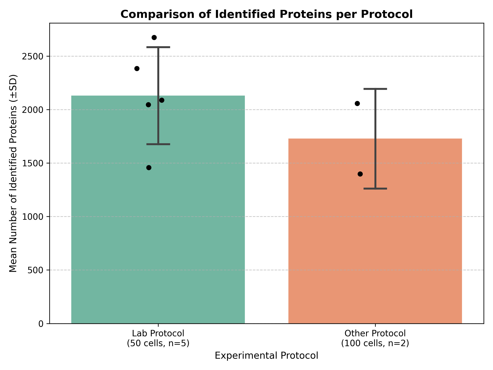

# Day 05 - Proteomics Sample Preparation Protocol Comparison

## Description
This project analyzes proteomics mass spectrometry (MS) data in order to compare the efficiency of two different sample preparation protocols.

The script loads an Excel file containing protein intensity values from multiple MS runs, and compares the average number of identified proteins between two experimental protocols.

### Input
The input dataset (`data.xlsx`) contains proteomics results generated by mass spectrometry (MS).

The last seven columns in the Excel file represent different samples:

- The first five samples (replicates) went through our lab's sample preparation protocol
- The last two samples (replicates) went through a different protocol developed by another lab that we wanted to try.

A protein is considered successfully identified if:
- Its intensity value is not missing (`NaN`)
- Its intensity value is greater than zero

### Output
The final output is a bar plot showing the mean number of detected proteins for each protocol, including standard deviation error bars and individual replicate points.




## Files:
* `analysis.py`: The main script that loads data, handles filtering, aggregates duplicates, counts identified proteins, and generates the bar plot.
  
* `data.xlsx`: Input proteomics raw dataset.
  
* `protocol_comparison.png`: Output bar plot.
  
* `test_analysis.py`: The tests verify: Correct handling of missing values (`NaN`), Ignoring invalid intensities (0 or negative values), Safe fallback behavior when gene names are missing.
  
* `requirements.txt`: List of required third-party python libraries.


## Requirements
This program uses several third-party libraries that need to be installed before running it:
```bash
   pip install -r requirements.txt
```


## AI Usage
I used [Gemini](https://gemini.google.com/app) to assist with the following things:

prompts:

1. היי, אני סטונדטית במעבדת פרוטאומיקה, יש לי קובץ אקסל עם כל החלבונים שזוהו מכל sample אתה יכול לעזור לי לכתוב קוד בפייתון שמשווה את מספר החלבונים הייחודים שזוהו עבור כל פרוטוקול (בממוצע) באמצעות bar plot?
זה הקובץ - 7 העמודות האחרונות מימין זה העמודות של הדגימות השונות עם הערכים של החלבונים השונים - מתוך ה7 האלו ה5 הראשונות (משמאל לימין) הן של פרוטוקול אחד וה2 הכי ימניות הן של פרוטוקול אחר.
2. תכתוב לי בבקשה טסטים לקוד. תשתמש בpytest
3. אני רוצה להוסיף תמונה לreadme file בgithub איך אני יכולה להקטין את איך שהתמונה תופיע?

